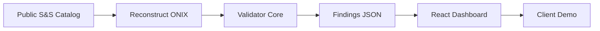

# CLAUDE_BUSINESS.md - Business/Demo Layer

This file guides Claude Code when building business-facing components for the MetaOps Validator diagnostic service.

## Project Context

You're building the **business/demo layer** for a **$4,950 5-day diagnostic** service targeting enterprise publishers (starting with Simon & Schuster). The technical validator exists; this layer presents findings professionally to close deals and deliver client value.

**Critical Business Context:**
- We're positioning as a **pre-feed validator complement to Firebrand/Eloquence**, not a replacement
- Target buyer: Publishing Operations teams who understand ONIX deeply
- Pricing: $4,950 for 5-day diagnostic → $7.5-10K/month for 3-month contracts
- Competition: No one else does contract→ONIX validation with KPI instrumentation

## Visual Identity: Pure Tufte

**ALL artifacts must use tufte.css as the foundation.** This signals data rigor and differentiates from vendor slop.

### Tufte Principles to Maintain
```css
/* Core Tufte rules - NEVER violate these */
- Line length: 55-65 characters (preserve readability)
- Margins: Use sidenotes and marginnotes for metadata
- Typography: ET Book font stack, no unnecessary fonts
- Data-ink ratio: Maximize data, minimize decoration
- No chartjunk: No 3D, gradients, or unnecessary graphics
- Tables > charts for precise values
```

### Approved Customizations
```css
/* These are OK to add to tufte.css */
.bignum { font-size: 2.2rem; color: #0f766e; } /* For KPI display */
.tag { border: 1px solid #999; padding: 0.08rem 0.4rem; } /* For [verified] tags */
.grid { display: grid; gap: 1rem; } /* For layout only */
```

### Visual Hierarchy
1. **Executive Deck**: Clean, sparse, data-forward (10-12 slides max)
2. **Technical Reports**: Dense but scannable, heavy use of sidenotes
3. **React Dashboard**: Interactive but restrained, no animations
4. **Sales Materials**: Professional, text-heavy, no marketing fluff

## Data Requirements & Ethics

### Acceptable Data Sources
```yaml
ALLOWED:
  - EDItEUR official samples and test files
  - Public catalog pages (simonandschuster.com, etc.)
  - Amazon/B&N public APIs (no scraping)
  - Library catalogs with public ONIX
  - SEC filings with contract examples
  - Reconstructed ONIX from public metadata

FORBIDDEN:
  - Scraping retailer sites beyond public APIs
  - Using client data without written permission
  - Generating fake ISBNs that could collide with real ones
  - Claiming access to proprietary feeds
```

### Data Credibility Tags
**EVERY metric and claim must be tagged:**
- `[verified]` - Deterministic from XSD/Schematron/codelist validation
- `[inference]` - Derived or assumed (ROI projections, impact estimates)

Example:
```html
<span class="bignum">42</span> critical errors
<span class="tag">[verified]</span> <!-- Always visible to user -->
```

## Namespace & Codelist Compliance

### ONIX Namespace Requirements
**ALL ONIX examples must be properly namespaced:**

```xml
<!-- CORRECT - Always use namespaced ONIX -->
<onix:Product xmlns:onix="http://ns.editeur.org/onix/3.0/reference">
  <onix:RecordReference>12345</onix:RecordReference>
  <onix:NotificationType>03</onix:NotificationType>
</onix:Product>

<!-- WRONG - Never show non-namespaced ONIX to clients -->
<Product>
  <RecordReference>12345</RecordReference>
</Product>
```

### Codelist Integration
When showing ONIX values, ALWAYS reference the codelist:
```html
<onix:ProductForm>BB</onix:ProductForm> <!-- List 150: Hardback -->
<onix:NotificationType>03</onix:NotificationType> <!-- List 1: Full notification -->
```

## Component Architecture

### 1. Presentation Layer (`presentation/`)
```
presentation/
├── sample_data/          # Demo data (findings.json, completeness.csv)
├── reports/              # Jinja2 templates for static reports
│   ├── current_state.html.j2
│   ├── case_view.html.j2
│   ├── exec_deck.html.j2
│   └── render_reports.py
└── demo-app/            # React dashboard for live demos
    └── src/
        ├── App.tsx      # Main dashboard with 5 core views
        └── tufte-overrides.css
```

### 2. Sales Toolkit (`toolkit/`)
```
toolkit/
├── brief/               # 2-page Tufte brief generator
├── emails/              # Templates for outreach sequence
├── linkedin/            # Connection and follow-up messages
├── scripts/             # Loom video outlines
├── proposals/           # SOW and pricing templates
├── discovery/           # Checklists for client meetings
└── objections/          # Response scripts for common pushbacks
```

### 3. Artifacts Output (`artifacts/`)
Generated deliverables for clients:
- `current_state_report.html` - Main technical findings
- `exec_deck.html` - Stakeholder presentation
- `case_view_*.html` - Individual ISBN deep dives
- `brief.html` - Sales collateral

## Demo Dashboard Requirements

### Five Core Views (React)
```typescript
// 1. Executive Summary
<BigNumber label="titles with findings" value={findings.length} tag="[verified]" />
<BigNumber label="$ impact potential" value={roi_range} tag="[inference]" />

// 2. Error Taxonomy
<TaxonomyTable categories={groupBy(findings, 'category')} />

// 3. Titles Drilldown
<FindingsTable data={findings} sortable={true} />

// 4. ISBN Case View
<CaseView isbn={selected} before={current_onix} after={proposed_onix} />

// 5. ROI & Prioritization
<ROICalculator assumptions={transparent} sliders={true} />
```

### Dashboard Data Flow


## Diagnostic Delivery Workflow

### Day 1: Kickoff & Baseline
```python
# What Claude Code should generate:
- Parse client's ONIX namespace (reference vs short)
- Run baseline validation
- Generate initial findings.json
- Tag everything [verified] or [inference]
```

### Day 2: Assessment Report
```python
# Generate current_state_report.html with:
- Error taxonomy heatmap
- Completeness distribution (0-4 scale)
- Top 10 problem ISBNs
- All metrics tagged with confidence
```

### Day 3: Custom Rules
```xml
<!-- Generate namespaced Schematron for top 3 problems -->
<sch:pattern id="territory-consistency">
  <sch:rule context="onix:Product/onix:PublishingDetail/onix:SalesRights">
    <!-- Real, specific, namespaced rules -->
  </sch:rule>
</sch:pattern>
```

### Day 4: KPI Blueprint
```yaml
# Generate KPI wiring plan:
error_rate:
  formula: errors_found / titles_processed
  owner: metadata_ops
  frequency: daily
  target: < 5%
  
time_to_correct:
  formula: timestamp_fixed - timestamp_detected
  owner: publishing_ops
  frequency: per_incident
  target: < 4 hours
```

### Day 5: Executive Readout
```html
<!-- exec_deck.html with Tufte styling -->
<section>
  <h2>What we found</h2>
  <p><strong>42</strong> critical errors costing <strong>$X</strong> monthly</p>
  <span class="tag">[verified]</span> <!-- Always show confidence -->
</section>
```

## Sales Sequence Automation

### Email Campaign Flow
```python
# Claude Code should generate personalized sequences:
1. intro_via_tim.md → If warm intro available
2. cold.md → Otherwise
3. bump_1.md → After 3 days no response
4. bump_2.md → After 7 days
5. recap.md → After meeting
```

### Proposal Generation
When generating proposals, ALWAYS include:
- Fixed price: $4,950 (non-negotiable for diagnostic)
- Clear scope: One imprint, up to 250 titles
- Defined deliverables: List all 10 artifacts
- Timeline: 5 business days from data receipt

## Common Patterns & Anti-Patterns

### DO ✅
- Use namespace-aware XPath in all rules
- Tag every metric with [verified] or [inference]
- Show specific ISBNs as proof points
- Include methodology notes in sidenotes
- Generate reproducible artifacts
- Maintain Tufte visual consistency

### DON'T ❌
- Scrape beyond public APIs
- Show non-namespaced ONIX
- Make claims without evidence tags
- Use marketing language ("revolutionary", "transform")
- Add unnecessary visual elements
- Promise integration beyond pilot scope

## Testing Your Output

### Validation Checklist
```bash
# Before delivering any artifact:
□ All ONIX examples are namespaced
□ Every metric has [verified] or [inference] tag
□ Tufte CSS is properly loaded
□ No scraping of private data
□ ISBNs are real or clearly marked as examples
□ ROI calculations show assumptions
□ Print CSS works for PDF export
```

### Demo Readiness
```bash
# Before client demo:
□ Dashboard loads in < 2 seconds
□ All views have real data (not lorem ipsum)
□ Case views show actual ONIX before/after
□ Export buttons produce valid files
□ Works offline (for laptop demos)
```

## Error Messages & Edge Cases

### When data is insufficient:
```html
<p class="marginnote">
  <span class="tag">[inference]</span> 
  Limited sample size (n=50) may not represent full catalog
</p>
```

### When findings are ambiguous:
```html
<td>Possible territory conflict</td>
<td>Confidence: 60%</td>
<td><span class="tag">[inference]</span></td>
```

### When client challenges a finding:
Always point to:
1. The specific rule (with ID)
2. The ONIX path that triggered it
3. The EDItEUR or contract reference
4. The confidence level and evidence tag

## Remember

You're building tools to **win a $4,950 diagnostic** that leads to a **$7.5-10K/month contract**. Every artifact should:
1. Look more professional than anything they've seen from vendors
2. Use real data and real validation (no fake metrics)
3. Follow Tufte principles religiously
4. Respect ONIX namespaces and codelists
5. Tag all claims with evidence levels
6. Focus on operational KPIs, not vanity metrics

The goal: Make publishing ops teams say "Finally, someone who gets it."